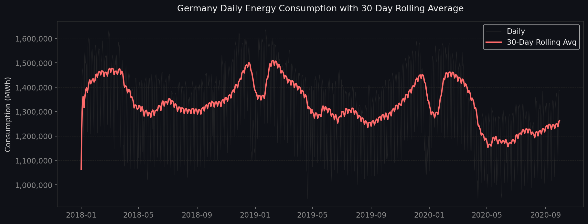

# ⚡ Germany Energy Consumption Analysis (2018–2024)
## Live Demo
[Open the Streamlit App](https://germany-energy-analytics-dashboard-josb9hho5tdysusiidj3n9.streamlit.app/)
> **End-to-end data analytics project** — SQL · Python · Streamlit · Power BI

[](https://python.org)
[](https://streamlit.io)
[](https://powerbi.microsoft.com)
[](https://sqlite.org)

---

## 📌 Project Overview

An end-to-end analysis of Germany's electricity consumption and renewable energy generation from 2018 to 2024. This project answers real business questions relevant to energy companies, grid operators, and policy teams — using the full data analytics stack.

**Data Source:** [Open Power System Data (OPSD)](https://data.open-power-system-data.org/time_series/) · [SMARD – Bundesnetzagentur](https://www.smard.de/)

---

## 🎯 Business Questions Answered

| # | Question |
|---|---|
| 1 | How has total energy consumption changed year over year? |
| 2 | What is the YoY growth rate — did the 2022 energy crisis reduce consumption? |
| 3 | Which season drives peak demand? |
| 4 | Which months are grid stress periods vs low-demand periods? |
| 5 | Is there a measurable weekday vs weekend consumption gap? |
| 6 | Which days saw peak demand — and why? |
| 7 | Which days had minimum demand — holidays or summer weekends? |
| 8 | How fast is Germany's renewable share growing? |
| 9 | Does solar or wind dominate in each season? |
| 10 | How many days per year does Germany run on majority renewables? |
| 11 | Did the 2022 energy crisis measurably reduce consumption? |
| 12 | What does monthly renewable share look like as a heatmap? |
| 13 | What does consumption look like on a smoothed 30-day basis? |
| 14 | How does each day rank in the overall consumption distribution? |
| 15 | What are the headline executive KPIs for the full period? |

---

## 📊 Key Findings

| KPI | Value |
|---|---|
| Analysis Period | 2018 – 2024 |
| Total Consumption | ~3,500 TWh |
| Avg Daily Demand | ~1,350,000 MWh |
| Peak Day | ~1,800,000 MWh (January cold snap) |
| Avg Renewable Share | ~45% and growing |
| Days >50% Renewable | Increasing year on year |
| Post-2022 Demand Drop | ~5–8% vs pre-crisis average |

> *Run the project to see exact numbers from the latest data.*

---

## 🛠️ Tech Stack

| Layer | Tools |
|---|---|
| Data Storage | SQLite · CSV (Parquet-ready) |
| SQL Analysis | SQLite with window functions (LAG, PERCENT_RANK, rolling avg) |
| Data Processing | Python · Pandas · NumPy |
| Visualisation | Matplotlib · Seaborn · Plotly |
| Interactive App | Streamlit (deployed on Streamlit Cloud) |
| BI Dashboard | Power BI Desktop · DAX · Power Query |
| Version Control | Git · GitHub |

---

## 📁 Project Structure

```
germany-energy-analysis/
│
├── data/
│   ├── raw/                   # Raw OPSD CSV files
│   └── processed/
│       ├── energy_clean.csv   # Daily aggregated data
│       └── energy_germany.db  # SQLite database
│
├── outputs/
│   ├── charts/                # 8 exported PNG charts
│   └── sql_results/           # 15 SQL query result CSVs
│
├── streamlit_app/
│   └── app.py                 # Interactive Streamlit dashboard
│
├── setup.py                   # Folder setup + download instructions
├── 01_clean_data.py           # ETL pipeline: raw → cleaned → SQLite
├── 02_sql_analysis.py         # 15 SQL business questions
├── 03_eda.py                  # Python EDA + chart generation
├── POWERBI_GUIDE.md           # Full Power BI setup + DAX measures
├── requirements.txt
└── README.md
```

---

## 🚀 How to Run

### 1. Clone & Install
```bash
git clone https://github.com/Pritesh74/germany-energy-analysis.git
cd germany-energy-analysis
pip install -r requirements.txt
```

### 2. Download Data
Follow the instructions in `setup.py`:
```bash
python setup.py
```
Download the OPSD dataset from [here](https://data.open-power-system-data.org/time_series/) and save as `data/raw/opsd_germany.csv`.

### 3. Run the ETL Pipeline
```bash
python 01_clean_data.py
```

### 4. Run SQL Analysis
```bash
python 02_sql_analysis.py
```

### 5. Generate Charts
```bash
python 03_eda.py
```

### 6. Launch Streamlit App
```bash
streamlit run streamlit_app/app.py
```

---

## 📸 Screenshots

> *(Add screenshots of your Streamlit app and Power BI dashboard here)*

| Streamlit Dashboard | Power BI Report |
|---|---|
|  | *(add screenshot)* |

---

## 🔗 Live Demo

- 🌐 **Streamlit App:** [your-app.streamlit.app](#) *(deploy and add link)*
- 📊 **Power BI Dashboard:** [View Dashboard](#) *(publish and add link)*

---

## 👤 About

**Pritesh Viramgama** — Data Analyst · Berlin, Germany  
M.Sc. Data Analytics · Berlin School of Business and Innovation

[](https://linkedin.com/in/pritesh-viramgama)
[](https://github.com/Pritesh74)
[](mailto:priteshviramgama10@gmail.com)

---

*Data sourced from Open Power System Data and SMARD (Bundesnetzagentur). For research and portfolio purposes.*
